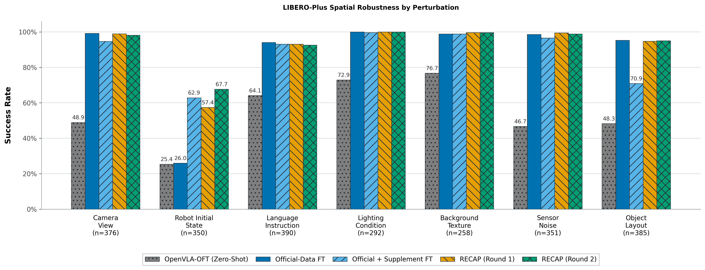
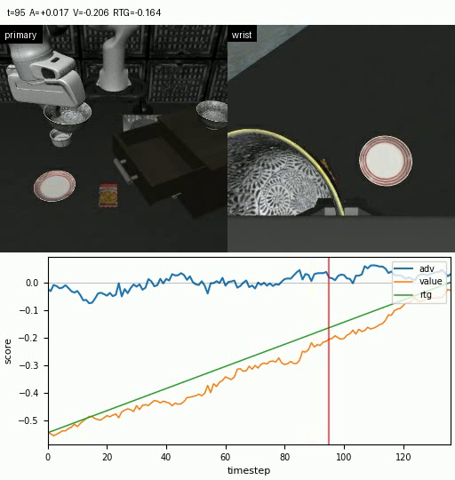
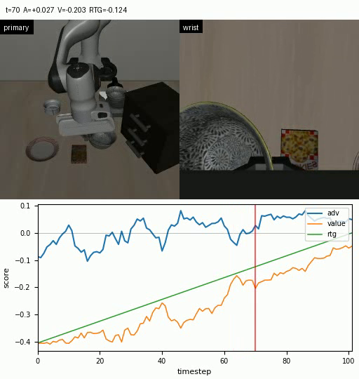
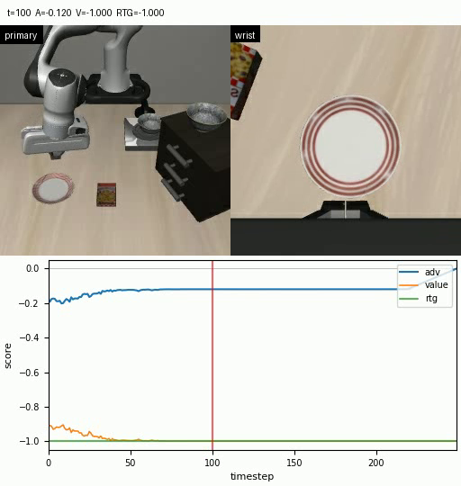
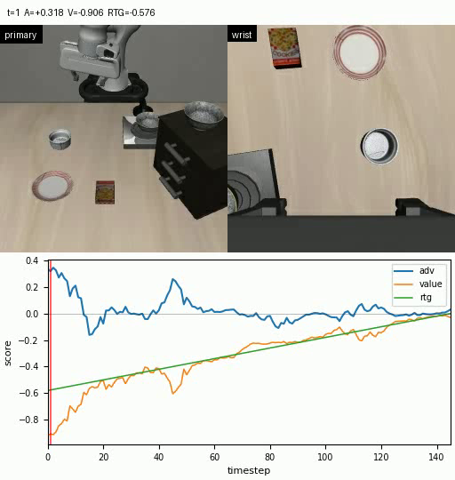

# OpenVLA-OFT: Fine-Tuning, Reproduction, and Improvement

本项目复现了 [OpenVLA-OFT](https://github.com/moojink/openvla-oft)，并参考 π*0.6 中的 RECAP 训练范式，使策略能够同时利用自主执行产生的成功与失败经验，以及人工采集的示范数据进行微调。项目在 LIBERO-Plus 中采集轨迹，通过仿真器重放验证数据，训练视觉—语言价值函数，离线估计每个时间步的 Advantage，并依据各语义任务的 Advantage 阈值进一步微调策略。本实现并非 π*0.6 RECAP 的完整复现，具体差异见[离线优势计算与语义任务优势阈值](#离线优势计算与语义任务优势阈值)。

## 本项目新增内容

| 模块 | 新增能力 |
| --- | --- |
| 自主数据采集 | 将策略执行得到的成功和失败轨迹分别导出为可重放的 HDF5 episode。 |
| 基于重放的数据验证 | 重放保存的 MuJoCo 状态和动作，过滤无效动作（no-op），重新生成观测，并根据实际重放结果重新划分成功和失败数据。 |
| 价值函数学习 | 使用两个相机视角、语言和本体感知输入微调 SmolVLM-500M，预测缩放后的累计回报（return-to-go，RTG）。 |
| 离线估计 Advantage | 使用 n-step estimator 离线计算 Advantage。 |
| 基于 Advantage 微调 | 依据各语义任务的 Advantage 分位数，筛选自主轨迹和恢复数据中的状态转移。 |

## 主要新增文件

| 路径 | 用途 |
| --- | --- |
| [`vla-scripts/finetune_value_function.py`](vla-scripts/finetune_value_function.py) | 微调基于 SmolVLM 的价值模型。 |
| [`vla-scripts/make_advantage_label.py`](vla-scripts/make_advantage_label.py) | 生成逐 episode 文件和每个数据集的扁平 Advantage table。 |
| [`vla-scripts/compute_quantile.py`](vla-scripts/compute_quantile.py) | 计算各语义任务的 Advantage 阈值。 |
| [`vla-scripts/recap_training.py`](vla-scripts/recap_training.py) | 执行 RECAP-inspired OpenVLA-OFT 微调。 |
| [`vla-scripts/visualize_advantage.py`](vla-scripts/visualize_advantage.py) | 生成轨迹帧、曲线和 Advantage overlay 视频。 |

## 实验结果

### 评测设置

本次比较使用固定的 LIBERO-Plus `libero_spatial` 评测集，其中包含 **2,402 个不同的任务变体**，覆盖七类扰动。每个策略对每个变体执行一次 rollout，并使用 benchmark 提供的默认初始状态。

下表保留结果文件中的运行别名：`zero-shot` 表示仅在原始 LIBERO 数据上完成 OpenVLA-OFT 微调、尚未使用 LIBERO-Plus 数据的策略；`official` 表示使用 LIBERO-Plus 官方数据微调的基线；`extra` 表示直接加入补充数据的微调基线；`recap1` 和 `recap2` 表示两轮 Advantage 门控微调。

<p align="center">
  <a href="assets/readme/success_rate_by_perturbation_en.png">
    
  </a>
</p>
<p align="center">
  <sub><strong>图 1.</strong> 五种策略在七类 LIBERO-Plus Spatial 扰动下的成功率。</sub>
</p>


| 策略 | 成功数 | 失败数 | Episode 数 | 成功率 | 相比官方数据微调 |
| --- | ---: | ---: | ---: | ---: | ---: |
| `zero-shot` | 1,284 | 1,118 | 2,402 | 53.46% | -33.60 pp |
| `official` | 2,091 | 311 | 2,402 | 87.05% | — |
| `extra` | 2,097 | 305 | 2,402 | 87.30% | +0.25 pp |
| `recap1` | 2,199 | 203 | 2,402 | 91.55% | +4.50 pp |
| **`recap2`** | **2,229** | **173** | **2,402** | **92.80%** | **+5.75 pp** |

### 不同扰动类别的结果

| 类别 | 任务数 | Zero-Shot | 官方数据微调 | 补充数据微调 | RECAP-1 | RECAP-2 | RECAP-2 相比官方数据微调 |
| --- | ---: | ---: | ---: | ---: | ---: | ---: | ---: |
| Camera | 376 | 48.94% | 99.20% | 94.68% | 98.94% | 98.14% | -1.06 pp |
| Robot initial state | 350 | 25.43% | 26.00% | 62.86% | 57.43% | **67.71%** | **+41.71 pp** |
| Language | 390 | 64.10% | 94.10% | 93.08% | 93.08% | 92.56% | -1.54 pp |
| Light | 292 | 72.95% | 100.00% | 99.66% | 100.00% | 100.00% | 0.00 pp |
| Background | 258 | 76.74% | 98.84% | 98.84% | 99.61% | 99.61% | +0.78 pp |
| Noise | 351 | 46.72% | 98.58% | 96.58% | 99.43% | 98.86% | +0.28 pp |
| Layout | 385 | 48.31% | 95.32% | 70.91% | 94.81% | 95.06% | -0.26 pp |
| **总计** | **2,402** | **53.46%** | **87.05%** | **87.30%** | **91.55%** | **92.80%** | **+5.75 pp** |

### 不同难度等级的结果

| 难度 | 任务数 | Zero-Shot | 官方数据微调 | 补充数据微调 | RECAP-1 | RECAP-2 | RECAP-2 相比官方数据微调 |
| --- | ---: | ---: | ---: | ---: | ---: | ---: | ---: |
| Level 1 | 480 | 66.25% | 91.88% | 96.67% | 95.83% | 96.25% | +4.38 pp |
| Level 2 | 669 | 59.19% | 90.73% | 91.03% | 93.57% | 93.57% | +2.84 pp |
| Level 3 | 630 | 50.16% | 88.25% | 86.98% | 91.75% | 93.49% | +5.24 pp |
| Level 4 | 432 | 47.45% | 86.57% | 79.86% | 90.74% | 92.82% | +6.25 pp |
| Level 5 | 191 | 25.65% | 59.16% | 68.59% | 74.87% | **79.06%** | **+19.90 pp** |

### 结果分析

- **覆盖目标域扰动的数据是鲁棒性提升的主要来源。** 从 zero-shot 到官方数据微调，总成功率由 53.46% 提高到 87.05%（+33.60 pp）。Camera、Language、Light、Background、Noise 和 Layout 分别提高 22.10～51.86 pp，而 Robot initial state 仅由 25.43% 提高到 26.00%。这表明，覆盖多种受控扰动的大规模训练数据对 VLA 的目标域鲁棒性非常重要；机器人初始状态变化仍是当前策略最难处理的扰动之一。

- **针对失败任务补充人类示范能够改善 Robot initial state，但直接混合数据会产生明显的鲁棒性权衡。** 为强化这一薄弱项，本项目针对失败任务额外采集了人类操作轨迹，并且没有直接复用 benchmark 提供的默认 initial state。加入补充数据后，Robot initial state 从 26.00% 提高到 62.86%（+36.86 pp），但 Camera、Language、Light、Noise 和 Layout 均有不同程度下降，其中 Layout 从 95.32% 降至 70.91%（-24.42 pp），最终总成功率仅提高 0.25 pp。该结果表现出明显的负迁移或遗忘，而不意味着补充数据本身没有提供有效信息。

- **RECAP 缓解了直接混合数据造成的遗忘，并进一步提升了 Robot initial state 鲁棒性。** 在使用补充数据的同时，引入策略自主执行得到的成功与失败轨迹，并依据离线 Advantage 进行筛选后，RECAP-2 相比直接补充数据基线提高 5.50 pp，多完成 132 个任务；Robot initial state 进一步由 62.86% 提高到 67.71%，Layout 则由 70.91% 恢复到 95.06%。相比官方数据微调基线，RECAP-2 提高 5.75 pp，多成功 138 次，并将失败数从 311 降至 173，相对减少 44.4%。

- **第二轮 RECAP 仍有收益，但也存在 episode 级别的恢复与退化。** RECAP-2 相比 RECAP-1 多成功 30 次，总成功率提高 1.25 pp。逐任务配对显示，第二轮将 99 个第一轮失败的任务转为成功，同时也使 69 个第一轮成功的任务变为失败。因此，第二轮并非对第一轮策略的单调改进，仍然存在一定程度的遗忘。

- **RECAP 对高难度任务的提升更明显。** LIBERO-Plus 的 Level 1～Level 5 根据 OpenVLA-OFT、π₀、π₀-Fast 和 UniVLA 四个参考模型在每个任务上的成功数量预先划分，而不是由本项目的结果或单一扰动参数决定。相比官方数据微调，RECAP-2 在 Level 1～5 上分别提高 4.38、2.84、5.24、6.25 和 19.90 pp，其中 Level 5 从 59.16% 提高到 79.06%。第二轮相对第一轮新增的 30 次净成功中，有 28 次来自 Level 3～5，说明在简单任务成功率已经较高的情况下，后续收益更多集中在参考模型定义下的困难任务。

### 价值函数与 Advantage 的可视化

以下为主相机、腕部相机与逐时间步的价值预测 `V`、监督目标 `RTG` 和离线估计的 `Advantage` 对齐。

<table>
  <tr>
    <td width="50%" align="center">
      <br>
      <sub><strong>官方示范（成功）</strong><br><code>libero_spatial / episode 555</code></sub>
    </td>
    <td width="50%" align="center">
      <br>
      <sub><strong>自主经验（成功）</strong><br><code>autonomous_success_iter_2 / episode 1250</code></sub>
    </td>
  </tr>
  <tr>
    <td width="50%" align="center">
      <br>
      <sub><strong>自主经验（失败）</strong><br><code>autonomous_failure_iter_2 / episode 4</code></sub>
    </td>
    <td width="50%" align="center">
      <br>
      <sub><strong>补充示范</strong><br><code>supplement_iter_2 / episode 3</code></sub>
    </td>
  </tr>
</table>
<p align="center">
  <sub><strong>图 2.</strong> 四类训练轨迹中的价值函数与 Advantage 输出。</sub>
</p>

## 方法细节

### 价值函数目标

价值模型以 `SmolVLM-500M-Instruct` 为 backbone，并使用 LoRA 微调。输入包括第三人称主相机图像、腕部相机图像、归一化语言指令和 8 维机器人本体感知状态。学习得到的 projector 将本体感知信息注入 `<proprio_0>` token，随后由 value head 预测对应的状态价值：`V(s) = sigmoid(value_logit) - 1`，因此输出范围为 `[-1, 0]`。

奖励函数的设置为：

```text
成功 / 官方轨迹：每个 transition 的 reward = -1，终止 reward = 0
失败轨迹：       每个 transition 的 reward = -1，终止惩罚 = -250
return_to_go = clip(reverse_cumsum(reward) / 250, -1, 0)
```

价值函数使用均方误差作为训练目标，并同时训练 SmolVLM LoRA adapter、proprio projector 和 value head。模型总参数量约为 527M，其中可训练参数约为 20M。

### 离线优势计算与语义任务优势阈值

Advantage 通过离线 30-step estimator 计算：

```text
A_t = sum(gamma^k * r_(t+k) / 250, k=0..h-1)
      + gamma^h * V(s_(t+h))
      - V(s_t),

h = min(30, 剩余轨迹长度)，gamma = 1。
```

对于每个语义任务，根据 Advantage 分布计算独立阈值，默认保留 Advantage 最高的 40% 样本。策略微调时，LIBERO-Plus 官方示范数据的损失权重固定为 1；其他数据集中高于对应任务阈值的样本权重为 1，低于阈值的样本权重为 0。直观地说，策略只学习 Advantage 相对较高的非官方样本。

与 π*0.6 的完整 RECAP 不同，本项目没有将二值 Advantage indicator 作为策略条件，也没有训练有条件与无条件策略以支持 classifier-free guidance。π*0.6 使用全部数据，并通过 `Advantage: positive/negative` 条件建模高、低 Advantage 行为；本项目则采用更简单的 loss gating：高于任务阈值的样本权重为 1，低于阈值的样本默认权重为 0。由于本实验使用的是 OpenVLA-OFT 的 L1 regression action head，而非 π*0.6 的 flow-matching action expert，因此没有复现其完整的 advantage-conditioning 与 CFG policy-extraction 机制。在本项目的初步试验中，在prompt中引入advantage indicator作为条件，并且赋予低 Advantage 样本非零的模仿损失权重未能改善最终表现，因此当前默认不使用这些样本更新策略。

## 环境配置

基础环境可参考 [OpenVLA-OFT](https://github.com/moojink/openvla-oft) 和 [LIBERO-Plus](https://github.com/sylvestf/LIBERO-plus) 的配置说明。需要注意的是，当价值函数使用 `SmolVLM-500M-Instruct` 作为 backbone 时，建议为价值函数单独创建环境，并将其中的 Transformers 库升级至兼容版本（本实验使用 `>=5.12.0`），避免与 OpenVLA-OFT 所依赖的 Transformers fork 冲突。当然也可以考虑使用其他兼容的 VLM 作为 backbone 。

## 基本流程

### 1. 微调初始策略

```bash
torchrun --standalone --nnodes 1 --nproc-per-node 1 vla-scripts/finetune.py \
  --vla_path openvla/openvla-7b \
  --data_root_dir /path/to/rlds \
  --dataset_name your_dataset_name \
  --run_root_dir /path/to/policy_runs \
  --use_l1_regression True \
  --use_diffusion False \
  --num_images_in_input 2 \
  --use_proprio True \
  --use_shared_action_bounds True \
  --use_shared_proprio_bounds True \
  --image_aug True \
  --lora_rank 32 \
  --wandb_entity YOUR_ENTITY \
  --wandb_project YOUR_PROJECT
```

### 2. 采集自主成功与失败轨迹

```bash
python experiments/robot/libero/export_eval_rollouts.py \
  --pretrained_checkpoint /path/to/policy_checkpoint \
  --task_suite_name libero_spatial \
  --num_trials_per_task 1 \
  --initial_states_path RESET \
  --language_instruction_mode official \
  --unnorm_key CHECKPOINT_DATASET_STATISTICS_KEY \
  --failed_episode_dir failed_episodes \
  --success_episode_dir success_episodes \
  --seed 0
```

### 3. 重放验证并再生成 HDF5

对于自主采集的成功和失败轨迹：

```bash
python experiments/robot/libero/regenerate_success_failure_autonomous_experiences_for_openvla.py \
  --libero_task_suite libero_spatial \
  --failed_episode_dir failed_episodes \
  --success_episode_dir success_episodes \
  --output_root autonomous_experience_openvla_dataset \
  --max_episode_length 250 \
  --post_set_init_dummy_steps 10 \
  --overwrite
```

对于单独采集的示范数据，使用：

```bash
python experiments/robot/libero/regenerate_recovery_dataset_for_openvla.py \
  --libero_task_suite libero_spatial \
  --recovery_demo_dir recovery_demonstration_data \
  --libero_target_dir recovery_openvla_dataset/libero_spatial_no_noops \
  --overwrite
```

继续后续流程前，需要使用外部 builder 把再生成的 HDF5 转换为已经注册的 RLDS 数据集。

### 4. 训练价值函数

```bash
torchrun --standalone --nnodes 1 --nproc-per-node 1 vla-scripts/finetune_value_function.py \
  --vlm_path HuggingFaceTB/SmolVLM-500M-Instruct \
  --data_root_dir /path/to/rlds \
  --dataset_name your_dataset_name \
  --run_root_dir /path/to/value_runs \
  --batch_size 8 \
  --image_size 512 \
  --use_shared_action_bounds True \
  --use_shared_proprio_bounds True \
  --merge_lora_during_training True \
  --wandb_entity YOUR_ENTITY \
  --wandb_project YOUR_PROJECT
```

### 5. 离线计算 Advantage 标签

```bash
 python vla-scripts/make_advantage_label.py \
    --data_root_dir /path/to/rlds \
    --dataset_name your_dataset_name \
    --pretrained_checkpoint /path/to/merged_value_checkpoint \
    --advantage_data_dir advantage_data \
    --split train \
    --batch_size 128 \
    --advantage_method n_step \
    --n_step 30 \
    --gamma 1.0 \
    --return_scale 250.0 \
    --use_shared_proprio_bounds True
```

每个数据集会在 `advantage_data/<dataset>/train/` 下生成逐 episode 的 `.npz`、扁平的 `advantage_table_<dataset>.npz` 和 `advantages_by_semantic.npy`。

### 6. 计算语义阈值并进一步微调策略

`compute_quantile.py` 当前在文件顶部配置数据集列表和 `positive_fraction`。仓库默认配置从自主成功和失败样本中计算 60% 分位数阈值，也就是为每个语义任务保留 advantage 最高的 40% 样本。

```bash
python vla-scripts/compute_quantile.py

torchrun --standalone --nnodes 1 --nproc-per-node 1 vla-scripts/recap_training.py \
  --vla_path /path/to/initial_policy_checkpoint \
  --data_root_dir /path/to/rlds \
  --dataset_name your_dataset_name \
  --run_root_dir /path/to/recap_runs \
  --advantage_data_dir advantage_data \
  --quantile_data_path advantage_data/quantile_by_semantic_train.npy \
  --recap_negative_loss_weight 0.0 \
  --use_l1_regression True \
  --use_diffusion False \
  --num_images_in_input 2 \
  --use_proprio True \
  --use_shared_action_bounds True \
  --use_shared_proprio_bounds True \
  --image_aug True \
  --lora_rank 32 \
  --wandb_entity YOUR_ENTITY \
  --wandb_project YOUR_PROJECT
```

### 7. 在 LIBERO-Plus 上评测

```bash
python experiments/robot/libero/run_libero_eval.py \
  --pretrained_checkpoint /path/to/final_checkpoint \
  --task_suite_name libero_spatial \
  --num_trials_per_task 1 \
  --initial_states_path DEFAULT \
  --language_instruction_mode official \
  --unnorm_key CHECKPOINT_DATASET_STATISTICS_KEY \
  --save_video True \
  --seed 7
```

## Acknowledgements

本项目基于 Moo Jin Kim、Chelsea Finn 和 Percy Liang 发布的 MIT-licensed [OpenVLA-OFT](https://github.com/moojink/openvla-oft) 开发，并参考 [π*0.6](https://arxiv.org/abs/2511.14759) 的 RECAP 训练范式，在 [LIBERO-Plus](https://github.com/sylvestf/LIBERO-plus) 上完成数据采集与评测。
